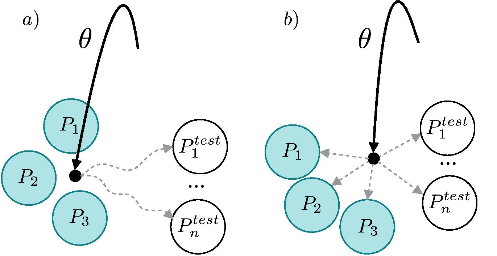
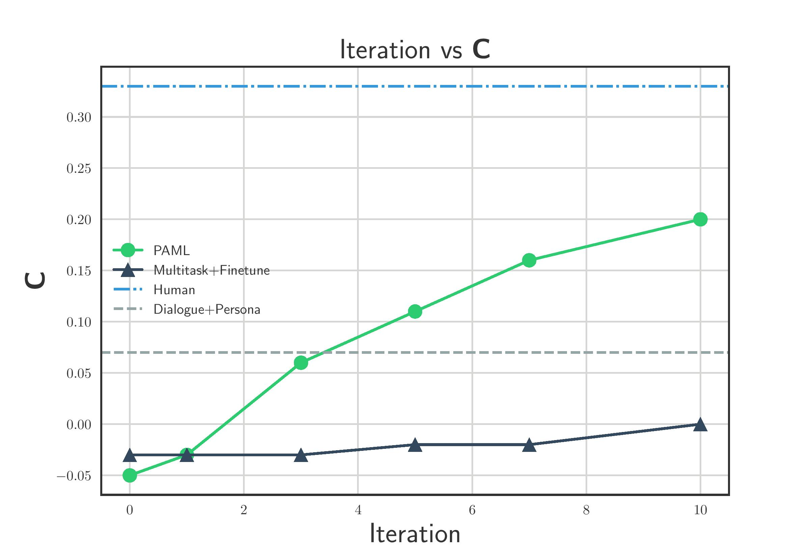
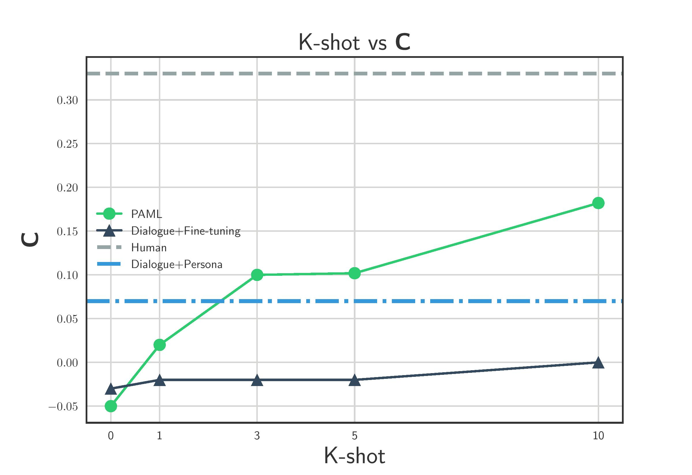

## PAML Personalizing Dialogue Agents via Meta-Learning
 [](https://opensource.org/licenses/MIT) 


This is the PyTorch implementation of the paper:
**Personalizing Dialogue Agents via Meta-Learning**. Zhaojiang Lin*, Andrea Madotto*, Chien-Sheng Wu, Pascale Fung  ***ACL 2019*** [[PDF]](https://arxiv.org/pdf/1905.10033.pdf)

[**Zhaojiang Lin**](https://zlinao.github.io/) and [**Andrea Madotto**](https://andreamad8.github.io/)  contributed equally to this work. 

This code has been written using PyTorch >= 0.4.1. If you use any source codes or datasets included in this toolkit in your work, please cite the following paper. The bibtex is listed below:
<pre>
@article{lin2019personalizing,
  title={Personalizing Dialogue Agents via Meta-Learning},
  author={Lin, Zhaojiang and Madotto, Andrea and Wu, Chien-Sheng and Fung, Pascale},
  journal={arXiv preprint arXiv:1905.10033},
  year={2019}
}
</pre>

## Abstract
Existing personalized dialogue models use human designed persona descriptions to improve dialogue consistency. Collecting such descriptions from existing dialogues is expensive and requires hand-crafted feature designs. In this paper, we propose to extend Model-Agnostic Meta-Learning (MAML) to personalized dialogue learning without using any persona descriptions. Our model learns to quickly adapt to new personas by leveraging only a few dialogue samples collected from the same user, which is fundamentally different from conditioning the response on the persona descriptions. Empirical results on Persona-chat dataset indicate that our solution outperforms non-meta-learning baselines using automatic evaluation metrics, and in terms of human-evaluated fluency and consistency.

## Persona-agnostic meta-learning

<p align="center">

</p>
The difference between finetuning from a) joint training on all personas and b) meta-learning persona. The solid line represents the optimization path of the initial parameters and dashed line the fine-tuning path. Meta-learned initial parameters can faster adapt to a new persona.

## Consistency improvement

<p align="center">

</p>

Iteration of finetuning versus consistency. Consistency of PAML grows linearly with respect to the iteration.

<p align="center">

</p>

K-shot (10 iteration) results for different settings. Consistency of PAML grows linearly with respect to finetune dialogue number.

## Dependency
Check the packages needed or simply run the command
```console
❱❱❱ pip install -r requirements.txt
```
[**Pre-trained glove embedding**](http://nlp.stanford.edu/data/glove.6B.zip): ***glove.6B.300d.txt*** inside folder /vectors/.

[**Trained NLI model**](https://drive.google.com/file/d/1Qawz1pMcV0aGLVYzOgpHPgG5vLSKPOJ1/view?usp=sharing) discribed in paper 3.1: ***pytorch_model.bin*** inside folder /data/nli_model/.
## Experiment

***Training***

Training PAML
```console
❱❱❱ python MAML.py --cuda --model trs --batch_size 16 --use_sgd --lr 0.01 --meta_lr 0.0003 --meta_batch_size 16 --meta_optimizer adam --pretrain_emb --weight_sharing --emb_dim 300 --hidden_dim 300 --fix_dialnum_train --pointer_gen --save_path save/paml/
```
Training baseline without persona input
```console
❱❱❱ python main.py --cuda --model trs --pretrain_emb --weight_sharing --label_smoothing --noam --emb_dim 300 --hidden_dim 300 --pointer_gen --save_path save/no_persona/ 
```
Training baseline with persona input
```console
❱❱❱ python main.py --cuda --model trs --pretrain_emb --weight_sharing --label_smoothing --noam --emb_dim 300 --hidden_dim 300 --pointer_gen --persona --save_path save/persona/
```

After training, take the model with lowest PPL in validation set to finetune and test (replace ${model}).

***Automatic metric***

Finetune and Testing PAML
```console
❱❱❱ python main_fine_tune.py --cuda --model trs --batch_size 16 --use_sgd --lr 0.01 --meta_lr 0.0003 --meta_batch_size 16 --meta_optimizer adam --pretrain_emb --weight_sharing --emb_dim 300 --hidden_dim 300 --pointer_gen --save_path save/paml/${model} --save_path_dataset save/paml/ --test
```
Finetune and Testing baseline without persona input
```console
❱❱❱ python main_fine_tune.py --cuda --model trs --batch_size 16 --use_sgd --lr 0.01 --meta_lr 0.0003 --meta_batch_size 16 --meta_optimizer adam --pretrain_emb --weight_sharing --emb_dim 300 --hidden_dim 300 --pointer_gen --save_path save/no_persona/${model} --save_path_dataset save/no_persona/ --test
```
Finetune and Testing baseline with persona input
```console
❱❱❱ python main_fine_tune.py --cuda --model trs --batch_size 16 --use_sgd --lr 0.01 --meta_lr 0.0003 --meta_batch_size 16 --meta_optimizer adam --pretrain_emb --weight_sharing --emb_dim 300 --hidden_dim 300 --pointer_gen --persona --save_path save/persona/${model} --save_path_dataset save/persona/ --test
```

***Generation samples***

To check generation of PAML:
```console
❱❱❱ python generate_samples.py --cuda --model trs --batch_size 1 --use_sgd --lr 0.01 --meta_lr 0.0003 --meta_batch_size 16 --meta_optimizer adam --pretrain_emb --weight_sharing --emb_dim 300 --hidden_dim 300 --pointer_gen --save_path save/paml/${model} --save_path_dataset save/paml/ --test
```
To skip training and finetune, check generation here: ***paml_generation***
